# 13 - Sequence Diagrams

## Propósito

Este documento describe el comportamiento dinámico de Aura mediante diagramas de secuencia.

Mientras los documentos anteriores definen la arquitectura, responsabilidades y modelos de datos, este documento muestra cómo colaboran los componentes durante la ejecución de distintos escenarios.

Los diagramas aquí presentados representan el comportamiento esperado del sistema y sirven como referencia para la implementación.

---

# Objetivos

Este documento debe:

- Mostrar el flujo completo de ejecución.
- Ilustrar la interacción entre módulos.
- Facilitar la comprensión de la arquitectura.
- Servir como referencia durante el desarrollo.
- Reducir ambigüedades sobre el orden de ejecución.

---

# Convenciones

Todos los diagramas utilizan la sintaxis Mermaid.

Los participantes mantienen siempre el mismo nombre en todos los escenarios.

## Participantes

| Participante | Descripción |
|-------------|-------------|
| Client | Usuario final. |
| Frontend | Interfaz de usuario. |
| Backend | Orquestador principal de Aura. |
| Intent Detection | Detector de intención. |
| Entity Extraction | Extractor de entidades. |
| Memory | Sistema de memoria. |
| RAG | Motor de recuperación de información. |
| Prompt Builder | Constructor del prompt. |
| LLM | Modelo de Lenguaje (Gemini). |
| Validator | Response Validator. |
| Tool System | Sistema de herramientas. |

---

# Flujo General

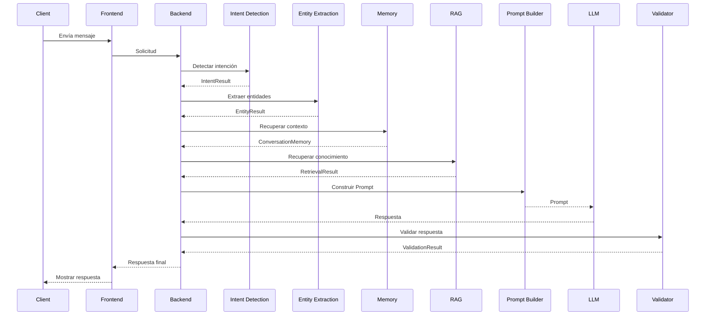

---

# Escenario 1 - Nuevo Cliente

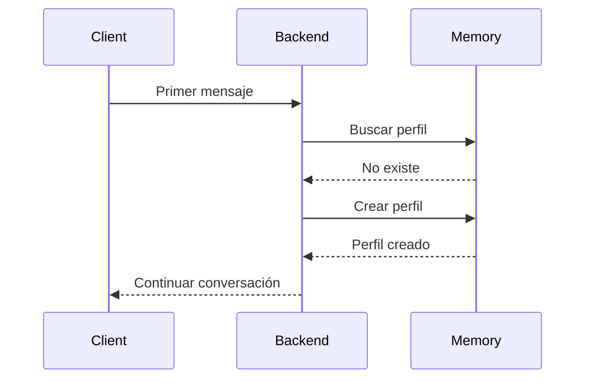

---

# Escenario 2 - Cliente Existente

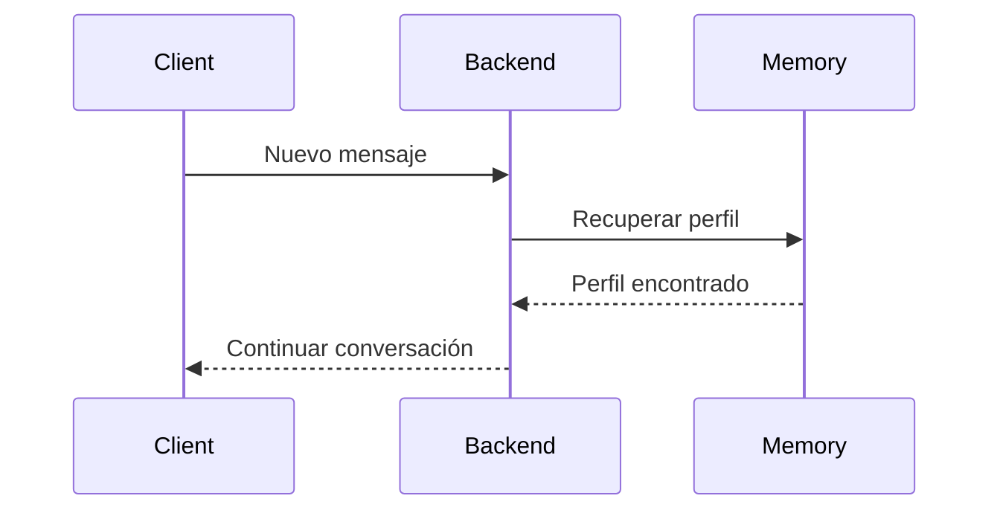

---

# Escenario 3 - Consulta de Información

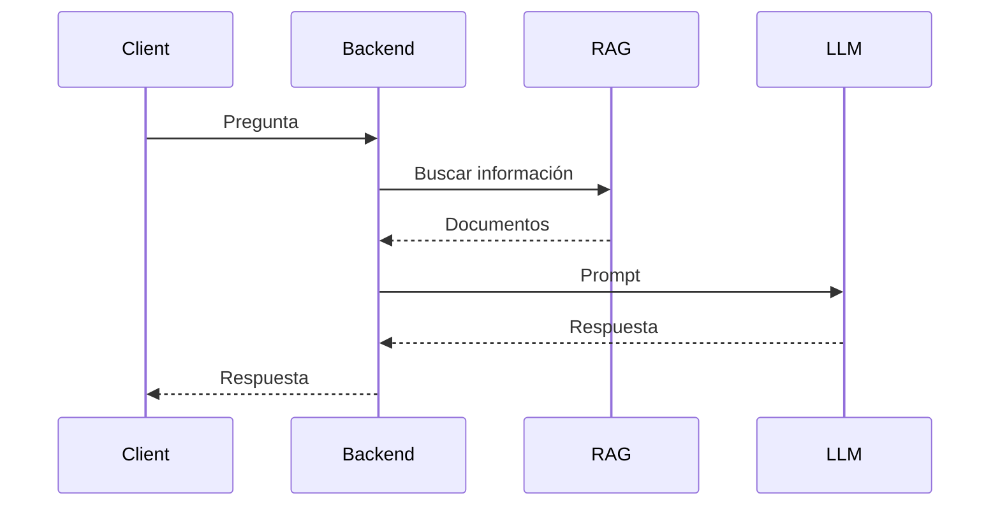

---

# Escenario 4 - Recomendación de Paquete

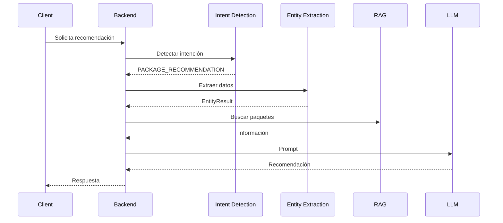

---

# Escenario 5 - Uso de Herramienta

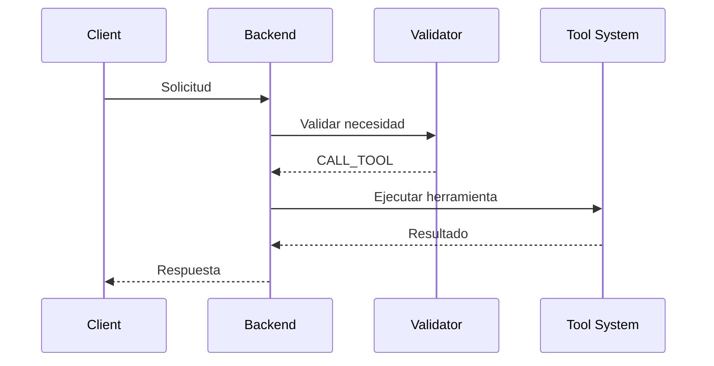

---

# Escenario 6 - Error de Herramienta

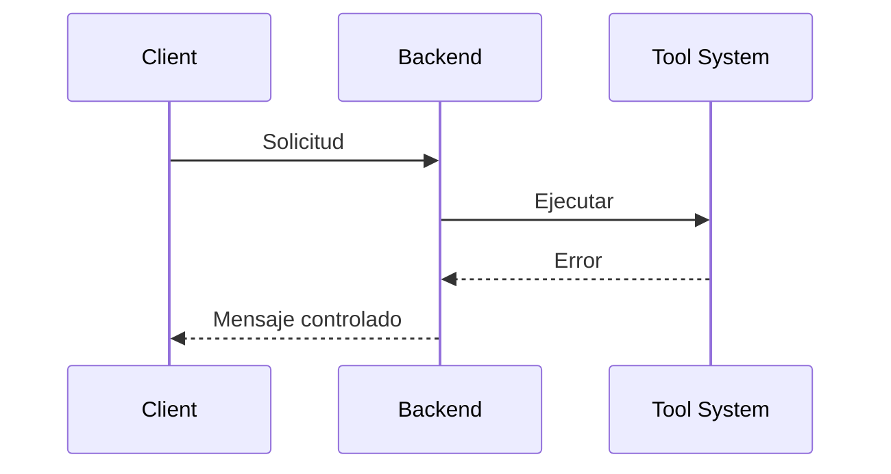

---

# Escenario 7 - Actualización de Memoria

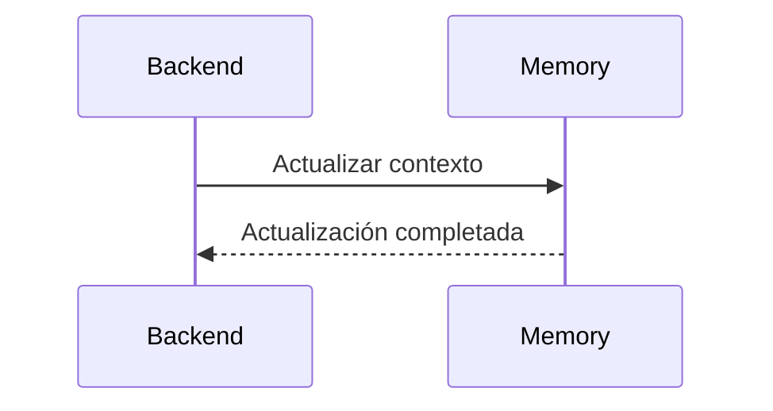

---

# Escenario 8 - Información No Disponible

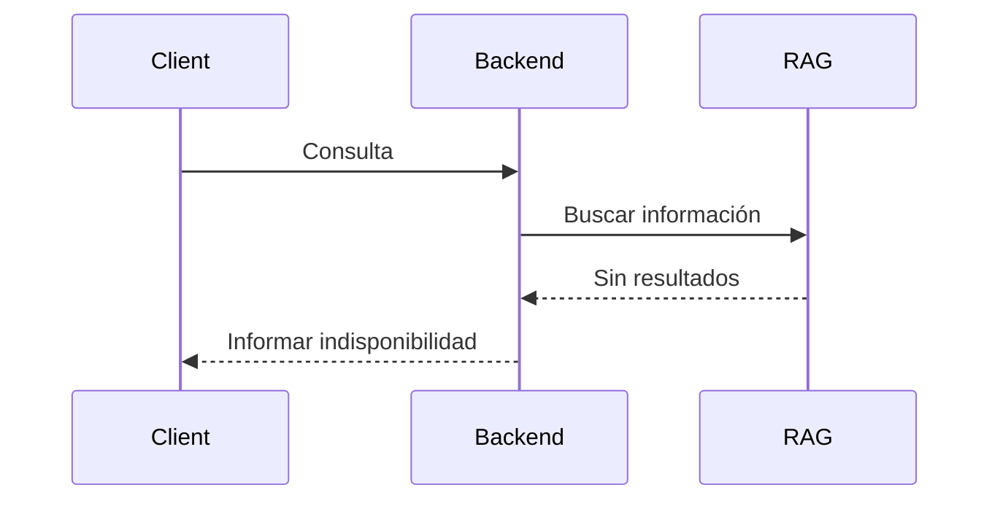

---

# Escenario 9 - Validación Rechazada

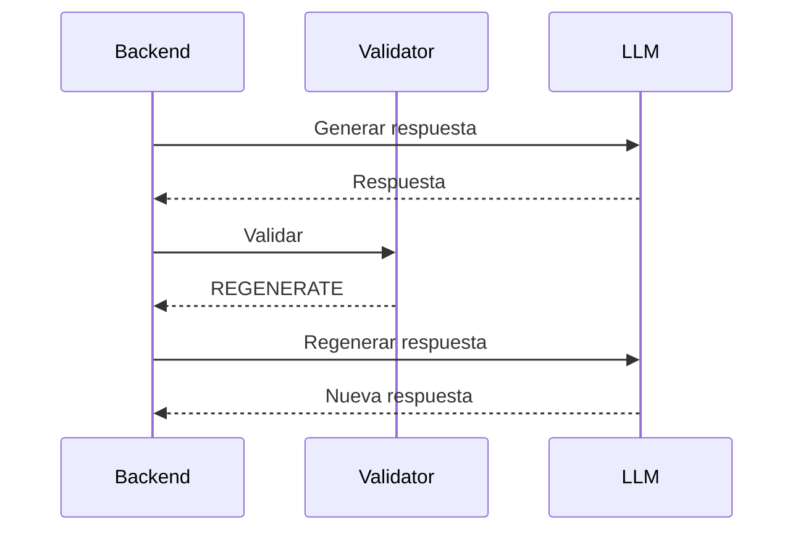

---

# Escenario 10 - Fin de Conversación

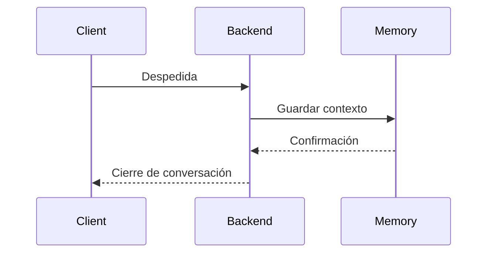

---

# Principios

Todos los diagramas respetan los siguientes principios:

- El Backend actúa como orquestador.
- Los módulos nunca se comunican directamente entre sí salvo a través del Backend.
- El LLM nunca consulta directamente la Base de Conocimiento.
- El RAG nunca genera respuestas.
- El Validator nunca modifica respuestas.
- El Tool System únicamente ejecuta herramientas autorizadas.
- Memory nunca reemplaza la Base de Conocimiento.
- Cada componente mantiene una única responsabilidad.

---

# Relación con otros documentos

Este documento complementa:

- 01_system_overview.md
- 02_request_pipeline.md
- 03_intent_detection.md
- 04_entity_extraction.md
- 05_memory_system.md
- 06_rag_engine.md
- 07_prompt_builder.md
- 08_response_validator.md
- 09_tool_system.md
- 10_data_models.md
- 11_security.md
- 12_deployment.md

---

# Estado

**Versión:** 1.0

**Estado:** En diseño 